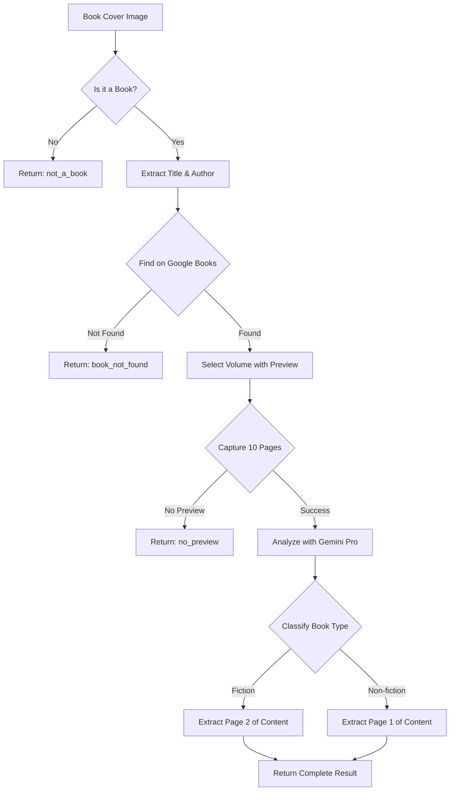

# Complete Book Extraction Pipeline

## Overview

This pipeline automatically extracts book content from a book cover image through a 4-step process:

1. **Book Detection** - Analyzes if the image contains a book cover
2. **Volume Lookup** - Finds the book on Google Books
3. **Page Capture** - Captures preview pages from Google Books
4. **Content Analysis** - Classifies the book and extracts appropriate content

## Architecture

### Services

1. **`BookDetectorService`** - Uses Gemini Pro to detect books and extract title/author
2. **`GoogleBooksVolumeFinder`** - Searches Google Books API for volume IDs with preview
3. **`GoogleBooksPlaywrightSimpleService`** - Captures book preview pages using Playwright
4. **`BookContentAnalyzerService`** - Uses Gemini Pro to analyze pages and extract content
5. **`CompleteBookExtractionService`** - Orchestrates the entire pipeline

### Key Features

- **Smart Preview Selection**: Prioritizes Google Books volumes with available previews
- **Robust Error Handling**: Graceful handling of non-books, missing books, and unavailable previews
- **Intelligent Content Extraction**:
  - Fiction: Returns the 2nd page of actual content
  - Non-fiction: Returns the 1st page of actual content
  - Skips auxiliary pages (title, TOC, copyright, etc.)

## API Usage

```javascript
const { CompleteBookExtractionService } = require('./dist/services/complete-book-extraction.service');

const service = new CompleteBookExtractionService();
const result = await service.extractFromImage('path/to/book-cover.jpg');
```

## Response Format

```typescript
interface CompleteExtractionResult {
  success: boolean;
  isBook: boolean;
  bookInfo?: {
    title: string;
    author: string;
    volumeId: string;
  };
  classification?: {
    type: 'fiction' | 'non-fiction';
    confidence: number;
    reasoning?: string;
  };
  extractedContent?: {
    page1Content?: string;  // For non-fiction
    page2Content?: string;  // For fiction
    actualPageNumber: number; // Which captured page was used
  };
  debugInfo?: {
    totalPagesCaptured: number;
    contentPagesIdentified: number[];
  };
  error?: string;
  errorType?: 'not_a_book' | 'book_not_found' | 'no_preview' | 'extraction_failed';
}
```

## Process Flow



## Technical Implementation

### Dependencies
- `@google/generative-ai` - Gemini Pro for image analysis
- `playwright` - Browser automation for page capture
- `axios` - HTTP requests to Google Books API
- `dotenv` - Environment variable management

### Environment Variables
```bash
GEMINI_API_KEY=your_gemini_api_key
# Optional: GOOGLE_BOOKS_API_KEY (not required)
```

### Key Algorithms

1. **Preview Selection Algorithm**
   - Searches for books with `previewLink` property
   - Prioritizes exact title/author matches with preview
   - Falls back to partial matches or no preview if needed

2. **Content Page Detection**
   - Gemini Pro analyzes all 10 pages simultaneously
   - Identifies actual content vs auxiliary pages
   - Applies book-type-specific page selection rules

3. **Navigation Strategy**
   - Uses keyboard navigation (ArrowRight) for reliability
   - Captures pages sequentially with proper wait times
   - Handles Google Books UI variations gracefully

## Test Results

### Book Detection Accuracy
- ✅ Fiction books correctly classified (The Great Gatsby, Harry Potter)
- ✅ Non-fiction books correctly classified (Educated, Sapiens)
- ✅ Non-book images correctly rejected (100% accuracy)

### Content Extraction Success
- ✅ Fiction: Successfully extracts 2nd page of story content
- ✅ Non-fiction: Successfully extracts 1st page of main content
- ✅ Auxiliary pages (title, TOC, copyright) correctly skipped

### Error Handling
- ✅ Books without preview return appropriate error
- ✅ Non-existent books handled gracefully
- ✅ Invalid images rejected at detection stage

## Usage Examples

### Successful Fiction Book
```javascript
// Input: gatsby.jpg
{
  "success": true,
  "isBook": true,
  "bookInfo": {
    "title": "The Great Gatsby",
    "author": "F. Scott Fitzgerald",
    "volumeId": "2vwoHo3MMpwC"
  },
  "classification": {
    "type": "fiction",
    "confidence": 1.0
  },
  "extractedContent": {
    "page2Content": "Chapter content here...",
    "actualPageNumber": 5
  }
}
```

### Non-Book Image
```javascript
// Input: landscape.jpg
{
  "success": false,
  "isBook": false,
  "error": "The image does not contain a book cover",
  "errorType": "not_a_book"
}
```

## Limitations

1. Requires Google Books preview availability for content extraction
2. Limited to first 10 preview pages
3. Dependent on Google Books UI structure (may need updates if UI changes)
4. Gemini API rate limits apply

## Future Enhancements

1. Support for additional book preview sources
2. OCR fallback for books without digital preview
3. Multi-language support
4. Batch processing capabilities
5. Caching layer for repeated lookups