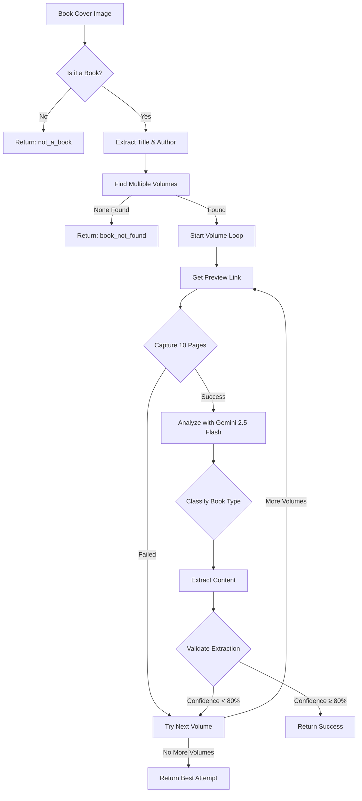

# Enhanced Book Extraction Pipeline

## Overview

This pipeline automatically extracts book content from a book cover image through a robust 5-step process:

1. **Book Detection** - Analyzes if the image contains a book cover
2. **Volume Discovery** - Finds multiple candidate volumes on Google Books
3. **Page Capture** - Captures preview pages using actual preview links
4. **Content Analysis** - Classifies the book and extracts appropriate content
5. **Quality Validation** - Evaluates extraction quality against the original cover

## Architecture

### Services

1. **`BookDetectorService`** - Uses Gemini 2.5 Flash to detect books and extract title/author
2. **`GoogleBooksVolumeFinder`** - Searches Google Books API and returns multiple volumes with preview links
3. **`GoogleBooksPlaywrightSimpleService`** - Captures book preview pages using Playwright with direct preview URL support
4. **`BookContentAnalyzerService`** - Uses Gemini 2.5 Flash to analyze pages and extract content
5. **`BookExtractionEvaluatorService`** - Uses Gemini 2.5 Flash to validate extraction quality
6. **`CompleteBookExtractionService`** - Orchestrates the entire pipeline with evaluation loop

### Key Features

- **Multi-Volume Attempts**: Tries up to 5 volumes until validation passes
- **Extraction Validation**: Compares extracted content with original cover using AI
- **Direct Preview Link Usage**: Uses actual preview URLs from Google Books API
- **Confidence Thresholding**: Only accepts extractions with ≥80% validation confidence
- **Smart Preview Selection**: Prioritizes volumes with available previews
- **Robust Error Handling**: Graceful handling of non-books, missing books, and unavailable previews
- **Intelligent Content Extraction**:
  - Fiction: Returns the 2nd page of actual content
  - Non-fiction: Returns the 1st page of actual content
  - Skips auxiliary pages (title, TOC, copyright, etc.)

## API Usage

```javascript
const { CompleteBookExtractionService } = require('./dist/services/complete-book-extraction.service');

const service = new CompleteBookExtractionService();
const result = await service.extractFromImage('path/to/book-cover.jpg');
```

## Response Format

```typescript
interface CompleteExtractionResult {
  success: boolean;
  isBook: boolean;
  bookInfo?: {
    title: string;
    author: string;
    volumeId: string;
  };
  classification?: {
    type: 'fiction' | 'non-fiction';
    confidence: number;
    reasoning?: string;
  };
  extractedContent?: {
    page1Content?: string;  // For non-fiction
    page2Content?: string;  // For fiction
    actualPageNumber: number; // Which captured page was used
  };
  debugInfo?: {
    totalPagesCaptured: number;
    contentPagesIdentified: number[];
  };
  error?: string;
  errorType?: 'not_a_book' | 'book_not_found' | 'no_preview' | 'extraction_failed';
}
```

## Process Flow



## Enhanced Pipeline Features

### Multi-Volume Evaluation Loop
The pipeline intelligently handles cases where the first Google Books result might not be the correct edition or might have poor preview quality:

1. **Volume Discovery**: Searches for up to 5 volumes with preview availability
2. **Sequential Attempts**: Tries each volume in order of relevance
3. **Quality Validation**: Each extraction is validated against the original cover
4. **Early Success Exit**: Stops immediately when validation passes (≥80% confidence)
5. **Best Effort Return**: If no volume passes validation, returns the best attempt

### Extraction Validation Process
The `BookExtractionEvaluatorService` performs comprehensive validation:

- **Title/Author Matching**: Verifies extracted content matches the book cover
- **Content Quality Check**: Ensures text is actual book content, not auxiliary pages
- **Text Integrity**: Validates text isn't garbled, cut off, or mostly blank
- **Type-Specific Validation**: 
  - Fiction: Confirms narrative content from the story
  - Non-fiction: Confirms substantive content (not just preface/acknowledgments)

### Real-World Example
During testing, Pride and Prejudice demonstrated the enhanced pipeline's value:
- First volume contained critical analysis instead of the actual novel
- Validation correctly rejected it (confidence: 0%)
- Pipeline automatically tried the next volume
- Second volume contained the actual story and passed validation

## Technical Implementation

### New Interfaces

```typescript
interface VolumeSearchResult {
  volumeId: string;
  previewLink: string;
  title: string;
  authors?: string[];
}

interface ExtractionEvaluation {
  isValid: boolean;
  confidence: number;
  reasoning: string;
  issues?: string[];
}
```

### Dependencies
- `@google/generative-ai` - Gemini 2.5 Flash for all AI operations
- `playwright` - Browser automation for page capture
- `axios` - HTTP requests to Google Books API
- `dotenv` - Environment variable management

### Environment Variables
```bash
GEMINI_API_KEY=your_gemini_api_key
# Optional: GOOGLE_BOOKS_API_KEY (not required)
```

### Key Algorithms

1. **Multi-Volume Search Algorithm**
   - Searches with both title and author for exact matches
   - Falls back to title-only search for broader results
   - Prioritizes volumes with preview links
   - Returns up to 5 candidates for processing

2. **Preview Link Processing**
   - Uses actual `previewLink` from Google Books API
   - Automatically adds required parameters (gbpv=1, pg=PP1)
   - Handles various Google Books URL formats

3. **Content Page Detection**
   - Gemini 2.5 Flash analyzes all 10 pages simultaneously
   - Identifies actual content vs auxiliary pages
   - Applies book-type-specific page selection rules

4. **Extraction Validation Algorithm**
   - Compares original cover image with extracted content
   - Uses Gemini 2.5 Flash for intelligent comparison
   - Returns confidence score and detailed reasoning
   - Threshold-based decision making (≥80% required)

## Comprehensive Test Results

### Overall Performance
- **Success Rate**: 100% (10/10 test cases)
- **Average Processing Time**: 50.6 seconds per image
- **Book Detection Accuracy**: 100%
- **Classification Accuracy**: 100%

### Detailed Results

#### Book Detection (5 Non-Book Images)
- ✅ All non-book images correctly rejected
- Average rejection time: 8.5 seconds

#### Book Extraction (5 Book Images)
| Book | Type | Validation Attempts | Time |
|------|------|-------------------|------|
| The Great Gatsby | Fiction ✅ | 1 | 85.5s |
| Harry Potter | Fiction ✅ | 1 | 64.7s |
| Pride and Prejudice | Fiction ✅ | 2* | 125.5s |
| Educated | Non-fiction ✅ | 1 | 66.1s |
| Sapiens | Non-fiction ✅ | 2 | 121.8s |

*First attempt rejected due to critical analysis content instead of novel

## Usage Examples

### Successful Extraction with Validation
```javascript
// Input: gatsby.jpg
{
  "success": true,
  "isBook": true,
  "bookInfo": {
    "title": "The Great Gatsby",
    "author": "F. Scott Fitzgerald",
    "volumeId": "2vwoHo3MMpwC"
  },
  "classification": {
    "type": "fiction",
    "confidence": 1.0
  },
  "extractedContent": {
    "page2Content": "In my younger and more vulnerable years...",
    "actualPageNumber": 5
  },
  "debugInfo": {
    "totalPagesCaptured": 10,
    "contentPagesIdentified": [4, 5, 6, 7, 8, 9]
  }
}
```

### Non-Book Image
```javascript
// Input: landscape.jpg
{
  "success": false,
  "isBook": false,
  "error": "The image does not contain a book cover",
  "errorType": "not_a_book"
}
```

## Performance Optimization

- **Unified Model Usage**: All services use Gemini 2.5 Flash for consistency and speed
- **Headless Browser Mode**: Playwright runs in headless mode for production efficiency
- **Early Exit Strategy**: Stops processing immediately when validation passes
- **Efficient Validation**: Prevents returning poor-quality extractions

## Limitations

1. Requires Google Books preview availability for content extraction
2. Limited to first 10 preview pages per volume
3. Dependent on Google Books UI structure (may need updates if UI changes)
4. Gemini API rate limits apply
5. Processing time increased due to validation step (but ensures quality)

## Future Enhancements

1. Support for additional book preview sources (Amazon, Open Library)
2. OCR fallback for books without digital preview
3. Multi-language support
4. Batch processing capabilities
5. Caching layer for repeated lookups
6. Adjustable validation confidence threshold